# Hi there 👋

## 👋 About Me
I'm Arrij Fawwad, an AI/ML and Software Engineer. I build production-grade, AI-integrated systems spanning Machine Learning, NLP, and LLMs from PostgreSQL extensions with embedded ML inference to RAG pipelines and multi-agent LLM systems. Comfortable across the full stack with Python, SQL, FastAPI, React/TypeScript, and Node.js, with working exposure to Docker, Kubernetes, CI/CD, and AWS.

🔭 **Currently working on**
- An AI-powered PostgreSQL extension (PL/Python) with embedded ML inference, vector search, and embedding-based retrieval as a Database Engine Developer Intern at Inzent, South Korea (remote)
- Refactoring a PostgreSQL extension + FastAPI backend + React/Vite frontend into independently maintainable, scalable components

🤝 **I'm looking to collaborate on**
- Open-source AI/ML and database-adjacent projects
- RAG pipelines, vector search, and multi-agent LLM systems
- Applied ML tooling and developer productivity apps

🌱 **Currently learning**
- Kubernetes and cloud-native deployment patterns
- Advanced prompt engineering and multi-agent orchestration (LangChain)
- GPU-accelerated ML workloads (CUDA, OpenACC, OpenCL)

💬 **Ask me about**
- PostgreSQL extensions, PL/Python, and embedded ML inference
- RAG pipelines, vector databases, and LLM-based multi-agent systems
- FastAPI, gRPC, and REST API design
- CUDA / GPU optimization for ML workloads

📍 Dubai, UAE

## 🎓 Education
**BS Computer Science** — FAST National University of Computer and Emerging Sciences, Islamabad, Pakistan (2022–2026)

## 💼 Experience
- **Database Engine Developer Intern**, Inzent (South Korea, Remote) — Apr 2026–Present
- **AI Software Development Intern**, AKSA Solutions Development Services — Jul–Aug 2025
- **AI Intern**, AI & ML Lab, FAST-NUCES — Jun–Aug 2024
- **Teaching Assistant & Lab Demonstrator**, FAST-NUCES — Jan 2023–Dec 2025

## 🚀 Featured Projects
- **[MARS – Multi-Agent Requirement Engineering System](#)** — FYP: multi-agent LLM pipeline (FastAPI, MongoDB, RabbitMQ, LangChain + Groq) automating requirement elicitation; neural net achieving 88% accuracy on conflict/duplicate detection
- **RAG-Powered CUDA Knowledge Chatbot** — RAG chatbot indexing 500+ pages of CUDA docs with vector embeddings for technical retrieval
- **Neural Network GPU Optimization** — Ported NN inference from CPU to GPU with CUDA/OpenACC, achieving up to 13.4× speedup
- **Votix – E-Voting Management System** — Secure real-time e-voting platform (Java, MySQL, SSE, VPN-encrypted transmission)

## 🛠️ Skills
**AI/ML:** Machine Learning · Deep Learning · NLP · LLMs · RAG · Transformers · Vector Embeddings · TensorFlow · LangChain
**Backend:** Python · FastAPI · Flask · Node.js · REST · gRPC · PostgreSQL · MongoDB · RabbitMQ
**Frontend:** React.js · TypeScript · JavaScript · HTML/CSS · Bootstrap
**Cloud/DevOps:** Docker · Kubernetes · Git/GitHub · AWS · CI/CD · N8N
**Parallel Computing:** CUDA · OpenMP · OpenACC · OpenCL

## 📜 Certifications
Generative AI Fundamentals (Google Cloud Skills Boost) · Building Your Own Database Agent (DeepLearning.AI) · Cloud Foundations (AWS Academy)

## 🌐 Socials
 

## 💻 Tech Stack
                     

## 📊 GitHub Stats
<!-- Generated nightly by .github/workflows/readme-stats.yml and streak-stats.yml — no live third-party fetch, so these won't break. -->
 
 

### 🔝 Top Contributed Repo

---

<!-- Proudly created with GPRM ( https://gprm.itsvg.in ) -->
